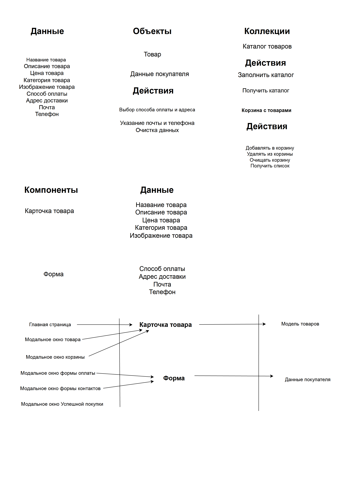

# Проектная работа "Веб-ларек"

Стек: HTML, SCSS, TS, Webpack

## Структура проекта:

- **src/** — исходные файлы проекта
- **src/components/** — папка с JS компонентами
- **src/components/base/** — папка с базовым кодом

  - **src/components/base/Api.ts** — класс для взаимодействия с серверным API
  - **src/components/base/Components.ts** — базовый класс для всех компонентов
  - **src/components/base/Events.ts** — класс для управления событиями
  - **src/components/base/Model.ts** - класс для всех моделей данных

- **src/components/common/** — папка с общими компонентами

  - **src/components/common/Basket.ts** — компонент корзины
  - **src/components/common/Modal.ts** — компонент модального окна
  - **src/components/common/Order.ts** — компонент формы заказа
  - **src/components/common/Success.ts** — компонент модального окна успешного заказа

- **src\components\AppData.ts** - отвечает за управление состоянием приложения, хранение данных, обработку событий и взаимодействие с сервером при необходимости.
- **src\components\Card.ts** - определяет два класса: ProductListItem и ProductPreview, которые представляют компоненты интерфейса пользователя для отображения информации о продуктах или карточек товаров
- **src\components\Contacts.ts** - представляет собой форму для связи с клиентом или отправки заказа и наследуется от класса `Form<IOrderProposal>`.
- **src\components\LarekAPI.ts** - используется для взаимодействия с API веб-приложения для получения информации о продуктах, списка продуктов и отправки заказов.
- **src\components\Page.ts** - используется для управления состоянием и отображением элементов на веб-странице, таких как счетчик, каталог продуктов и блокировка страницы при определенных условиях.

## Важные файлы:

- **src/pages/index.html** — HTML-файл главной страницы
- **src/types/index.ts** — файл с типами
- **src/index.ts** — точка входа приложения
- **src/scss/styles.scss** — корневой файл стилей
- **src/utils/constants.ts** — файл с константами
- **src/utils/utils.ts** — файл с утилитами

## Установка и запуск

Для установки и запуска проекта необходимо выполнить команды

```
npm install
npm run start
```

или

```
yarn
yarn start
```

## Сборка

```
npm run build
```

или

```
yarn build
```

## Архитектура проекта



### Базовые компоненты

- **Api**: класс для взаимодействия с серверным API.
- **Component**: базовый класс для всех компонентов.
- **EventEmitter**: класс для управления событиями.
- **Model**: базовый класс для всех моделей данных.

### Общие компоненты

- **Basket**: компонент корзины.
  Атрибуты:
  \_items: HTMLElement Элемент, представляющий список товаров в корзине.
  \_total: HTMLElement Элемент, отображающий общую стоимость товаров в корзине.
  \_button: HTMLElement Кнопка, которая может быть использована для подтверждения заказа или другой действия.

Сonstructor:
constructor(container: HTMLElement, actions?: ICardActions)
Инициализирует объект Basket, привязывая переданный контейнер и действия.
Находит и сохраняет необходимые элементы в контейнере.
Привязывает обработчик событий к кнопке, если она присутствует.

Методы:
set items(items: HTMLElement[])
Устанавливает товары в корзине. Если список товаров пуст, отображается сообщение "Корзина пуста".
set total(total: number) Устанавливает общую стоимость товаров в корзине.
buttonDisable(state: boolean) Включает или отключает кнопку в зависимости от переданного состояния.

- **BasketItem**: предназначен для управления отдельным элементом (товаром) в корзине
  Атрибуты:
  \_index: HTMLElement - Элемент, отображающий индекс товара в корзине.
  \_title: HTMLElement - Элемент, отображающий название товара.
  \_price: HTMLElement - Элемент, отображающий цену товара.
  \_deleteButton: HTMLButtonElement - Кнопка для удаления товара из корзины.

Конструктор:
constructor(container: HTMLElement, actions?: ICardActions)
Инициализирует объект BasketItem, привязывая переданный контейнер и действия.
Находит и сохраняет необходимые элементы в контейнере.
Привязывает обработчик событий к кнопке удаления, если она присутствует.
Методы:
set title(title: string) Устанавливает название товара.
set price(price: number) Устанавливает цену товара.
set index(index: number) Устанавливает индекс товара.

Интерфейс IBasketOverview
Определяет структуру данных для корзины:
items: HTMLElement[]
total: HTMLElement
basketButton: HTMLButtonElement
title: HTMLElement

Интерфейс IBasketProduct
Определяет структуру данных для товара в корзине:
index: number
title: string
price: number

- **ModalWindow**: компонент модального окна.

Атрибуты:
\_closeButton: HTMLButtonElement Кнопка закрытия модального окна, инициализируется через метод ensureElement.
\_content: HTMLElement Контент модального окна, инициализируется через метод ensureElement.
events: IEvents Интерфейс событий, используемый для эмиссии событий открытия и закрытия модального окна.

Методы:
set content(value: HTMLElement):Устанавливает новый контент для модального окна.
open():Открывает модальное окно, добавляет CSS класс и эмитирует событие открытия.
close():Закрывает модальное окно, убирает CSS класс, очищает контент и эмитирует событие закрытия.
render(data: IModalData): HTMLElement:Рендерит данные в модальное окно и открывает его.

Инициализирует атрибуты и добавляет обработчики событий для закрытия модального окна.
constructor(protected events: IEvents, container: HTMLElement) {
super(container);

    this._closeButton = ensureElement<HTMLButtonElement>('.modal__close', container);
    this._content = ensureElement<HTMLElement>('.modal__content', container);

    this._closeButton.addEventListener('click', this.close.bind(this));
    this.container.addEventListener('click', this.close.bind(this));
    this._content.addEventListener('click', (event) => event.stopPropagation());

}

- **ConfirmationModal** управляет модальным окном подтверждения в приложении

Атрибуты:
title: HTMLElement Заголовок модального окна подтверждения, инициализируется через querySelector.
\_description: HTMLElement Описание модального окна, инициализируется через querySelector.
buttonToMainPage: HTMLButtonElement Кнопка закрытия модального окна подтверждения, инициализируется через querySelector.

Инициализирует атрибуты и добавляет обработчик события для кнопки закрытия.
constructor(container: HTMLElement, protected events: IEvents) {
super(container);
this.title = this.container.querySelector('.order-success**title');
this.\_description = this.container.querySelector('.order-success**description');
this.buttonToMainPage = this.container.querySelector('.order-success\_\_close');
this.buttonToMainPage.addEventListener('click', this.submitSuccessHandler.bind(this));
}

Методы:
set description(value: string):Устанавливает новое описание для модального окна подтверждения.
submitSuccessHandler():Обработчик события для кнопки закрытия, эмитирует событие закрытия модального окна подтверждения.

**Интерфейс IModalData** Определяет структуру данных, которые используются для рендеринга модального окна.

Атрибуты:

content: HTMLElement - элемент, который будет отображаться в содержимом модального окна.

**Интерфейс ISuccessModal** Определяет структуру данных, используемую для модального окна успешного завершения заказа.

Атрибуты:

title: HTMLElement - элемент заголовка модального окна.
totalPrice: HTMLElement - элемент, показывающий общую стоимость.
buttonToMainPage: HTMLButtonElement - кнопка для перехода на главную страницу.

- **Form** общая логика управления формой

Атрибуты:

protected container: HTMLFormElement - контейнер формы.
protected events: IEvents - объект для управления событиями.
protected submitButton: HTMLButtonElement - кнопка отправки формы.
protected errorElement: HTMLElement - элемент для отображения ошибок.

Методы:

constructor(container: HTMLFormElement, events: IEvents) - инициализация формы.
protected onInputChange(field: keyof T, value: string) - обработка изменения ввода.
set valid(value: boolean) - установка состояния кнопки отправки (активна/неактивна).
set errors(value: string) - установка текста ошибок.
handleSubmit(e: Event) - обработка отправки формы.
handleInputEvent(e: Event) - обработка ввода в форме.
buttonDisable(state: boolean) - отключение/включение кнопки отправки.
clearOrderForm() - очистка формы.
render(state: Partial<T> & IFormState) - рендеринг состояния формы.

- **OrderForm**: компонент формы заказа.

Атрибуты:

inputAddress: HTMLInputElement - поле ввода адреса.
paymentMethodCash: HTMLButtonElement - кнопка выбора оплаты наличными.
paymentMethodOnline: HTMLButtonElement - кнопка выбора онлайн оплаты.
Методы:

constructor(container: HTMLFormElement, events: IEvents) - инициализация формы заказа.
setupEventListeners() - установка слушателей событий для полей и кнопок.
handleAddressInputChange() - обработка изменения ввода адреса.
handleCashPaymentClick() - обработка выбора оплаты наличными.
handleOnlinePaymentClick() - обработка выбора онлайн оплаты.
handlePayment(method: string, pressedButton: HTMLButtonElement, eventName: string, otherButton: HTMLButtonElement) - общая обработка выбора метода оплаты.
clearOrderForm() - очистка формы заказа.
toggleButtonState() - переключение состояния кнопки отправки в зависимости от наличия введенного адреса.

- **Взаимосвязь классов**
  OrderForm расширяет функциональность Form, добавляя специфичные для заказа атрибуты и методы, такие как обработка методов оплаты и ввода адреса.
  Основные действия, такие как отправка формы, изменение состояния кнопок и очистка формы, наследуются из Form и могут быть переопределены или дополнены в OrderForm.

- **SuccessModal**: компонент модального окна успешного заказа.

Атрибуты:

protected title: HTMLElement - элемент заголовка модального окна.
protected \_description: HTMLElement - элемент для описания или сообщения модального окна.
protected buttonToMainPage: HTMLButtonElement - кнопка для закрытия модального окна и возврата на главную страницу.
Методы:

constructor(container: HTMLElement, protected events: IEvents) - конструктор класса. Инициализирует элементы модального окна, а также устанавливает обработчик события для кнопки.
this.title - инициализируется элементом с классом .order-success**title.
this.\_description - инициализируется элементом с классом .order-success**description.
this.buttonToMainPage - инициализируется элементом с классом .order-success\_\_close.
Устанавливается обработчик клика на кнопке, который вызывает метод handleSuccessSubmit.
set description(value: string) - сеттер для установки текста в элемент описания (\_description).
handleSuccessSubmit() - метод обработки клика по кнопке закрытия. Этот метод эмитирует событие 'modalSucces:close', которое, вероятно, сигнализирует об окончании отображения модального окна.

**Интерфейс ISuccessModal** Этот интерфейс определяет, какие элементы HTML должны присутствовать в модальном окне и какие типы данных они должны иметь

Атрибуты:

title: HTMLElement - элемент заголовка модального окна, предназначенный для отображения заголовка.
totalPrice: HTMLElement - элемент для отображения общей суммы заказа (хотя в коде SuccessModal он не используется, возможно, это элемент, который будет добавлен позже).
buttonToMainPage: HTMLButtonElement - кнопка для возвращения на главную страницу, используемая для закрытия модального окна.

## Программный интерфейс компонентов и назначение каждой части

### Api Класс для взаимодействия с серверным API.

Основные методы:

- `get(uri: string)`: выполнение GET-запросов.
- `post(uri: string, data: object, method: ApiPostMethods)`: выполнение POST/PUT/DELETE-запросов.

### Component Базовый класс для всех компонентов.

Атрибуты:

protected readonly container: HTMLElement - корневой элемент DOM, с которым работает компонент. Этот элемент используется для доступа к DOM-элементам и их изменениям.

constructor(protected readonly container: HTMLElement) - конструктор класса. Инициализирует компонент, принимая корневой элемент container, который используется для работы с DOM.

- `toggleClass(element: HTMLElement, className: string, force?: boolean)`: переключение класса.
- `setDisabled(element: HTMLElement, state: boolean)`: установка состояния disabled.
- `setText(element: HTMLElement, value: string)`: установка текстового содержимого.
- `setImage(element: HTMLImageElement, src: string, alt?: string)`: установка изображения.
- `render(data?: Partial<T>)`: рендеринг компонента.

### EventEmitter Класс для управления событиями.

Атрибуты:

`_events: Map<EventName, Set<Subscriber> `- это приватное свойство, которое представляет собой Map, где ключом является тип события (EventName), а значением - множество подписчиков на это событие.

`constructor()` - конструктор класса, инициализирующий атрибут \_events как пустую Map.

- `on(event: EventName, callback: Subscriber)`: установка обработчика на событие.
- `off(event: EventName, callback: Subscriber)`: снятие обработчика с события.
- `emit(event: string, data?: object)`: инициирование события.
  `onAll(callback: (event: EmitterEvent) => void)` - метод для установки обработчика на все события.
  `offAll() `- метод для удаления всех обработчиков всех событий. Сбрасывает \_events до пустого состояния
  `trigger<T extends object>(eventName: string, context?: Partial<T>) `- метод для создания колбэка-триггера, который инициирует событие при вызове.

### Model Базовый класс для всех моделей данных. Основные методы:

- `emitChanges(event: string, payload?: object)`: уведомление об изменениях модели.

## Типы данных

Приложение работает с различными типами данных, основными из которых являются:

- **ICard**: информация о карточке товара.
  Свойства:

title: string - Заголовок товара.
id: string - Уникальный идентификатор товара.
description: string - Описание товара.
category: string - Категория товара.
price: number | null - Цена товара. Может быть числом или null, если цена не указана.
image: string - URL изображения товара.
Методы:

buttonDisable(state: boolean): void - Метод для включения или отключения кнопки. state указывает, должен ли быть элемент активным (false) или отключенным (true).

- **IOrderProposal**: интерфейс описывает структуру предложения заказа.
  Свойства:

email: string - Электронная почта заказчика.
phone: string - Телефонный номер заказчика.
payment: string - Метод оплаты (например, наличные или онлайн).
address: string - Адрес доставки.
total: number - Общая сумма заказа.
items: string[] - Список идентификаторов или названий товаров, включенных в заказ.

-**LabelsType** тип представляет собой набор допустимых значений для меток

Возможные значения:

'софт-скил' - Soft skills (мягкие навыки).
'другое' - Другое.
'дополнительное' - Дополнительное.
'кнопка' - Кнопка.
'хард-скил' - Hard skills (жесткие навыки).

- **IFormState**: состояние формы.

Атрибуты:

valid: boolean - логическое значение, указывающее, является ли форма валидной. Это значение может использоваться для включения или отключения кнопки отправки формы или для отображения сообщений об ошибках.
errors: string[] - массив строк, содержащий сообщения об ошибках формы. Этот массив может использоваться для отображения ошибок в форме или для других целей, связанных с обработкой ошибок.

- **IPaymentModifiedEvent** интерфейс описывает событие изменения метода оплаты

Свойства:

method: string - Метод оплаты, который был изменен (например, "cash" или "online").

## Взаимодействие частей приложения

Компоненты взаимодействуют друг с другом через события и API. Например, `OrderForm` использует `EventEmitter` для отправки событий при изменении данных формы или ее отправке. `ModalWindow` слушает события и открывается или закрывается в зависимости от них.

## Реализуемые классы

`Api`

## Атрибуты:

`baseUrl`: string — базовый URL для API запросов.
`options`: RequestInit — настройки для запросов.

## Методы:

- `get(uri: string): Promise<object>` — выполнение GET-запросов.
- `post(uri: string, data: object, method: ApiPostMethods = 'POST'): Promise<object>` — выполнение POST/PUT/DELETE-запросов.

## Атрибуты:

`container: HTMLElement` — контейнер для компонента.

## Методы:

- `toggleClass(element: HTMLElement, className: string, force?: boolean): void` — переключение класса.
- `setDisabled(element: HTMLElement, state: boolean): void `— установка состояния disabled.
- `setText(element: HTMLElement, value: string): void` — установка текстового содержимого.
- `setImage(element: HTMLImageElement, src: string, alt?: string): void` — установка изображения.
- `render(data?: Partial<T>): HTMLElement `— рендеринг компонента.

**EventEmitter**

## Методы:

- `on(event: EventName, callback: Subscriber): void` — установка обработчика на событие.
- `off(event: EventName, callback: Subscriber): void` — снятие обработчика с события.
- `emit(event: string, data?: object): void` — инициирование события.

**Model**
Атрибуты:

events: IEvents - это защищенное свойство, представляющее интерфейс IEvents, который, вероятно, предоставляет методы для работы с событиями.

Методы:
constructor(data: Partial<T>, events: IEvents) - конструктор класса, принимающий частичные данные типа T и объект events типа IEvents

- `emitChanges(event: string, payload?: object): void `— уведомление об изменениях модели.

## Пользовательские события

- `order:open `— открытие заказа.
- `order:change `— изменение данных заказа.
- `contacts:change `— изменение данных контактов.

## Паттерн проектирования (MVC) и распределение классов между слоями

Для данного проекта подходит паттерн MVC (Model-View-Controller). Распределение классов между слоями:

- **Model**:

  - `Model`
  - `AppData`

- **View**:

  - `Component`
  - `Basket`
  - `ModalWindow`
  - `OrderForm`
  - `SuccessModal`

- **Controller**:
  - `Api`
  - `EventEmitter`
